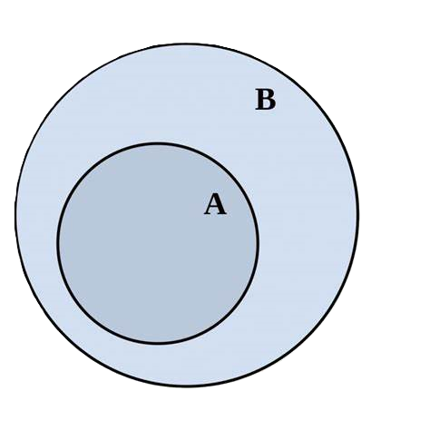
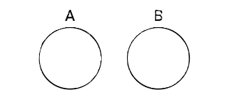

# Sets
- Sets are unordered collection of data items.
- They store multiple items in a single variable. 
- Set items are separated by commas and enclosed within curly brackets {}. 
- Sets do not contain duplicate items.

#### Example:
```python
info = {'Python', 7, True, None}
print(info)
```
#### Output:
```
{None, 'Python', True, 7}
```

## Accessing set items:
### Using a For loop
You can access items of set using a for loop. 

#### Example:
```python
info = {'Python', 7, True, None}
for item in info:
    print(item)
```
#### Output:
```
None
True
Python
7
```

# Set Methods
There are several in-built methods used for the manipulation of set.Most of the methods are just as what operation we learn on sets in mathematics. Methods are explained below

## issubset() and issuperset() :



From the above image we can understand that **A is a subset of B** and **B is a superset of A**.

### issubset()
- The issubset() method checks if all items of the original set are present in another set, returning True if they are, and False otherwise

```py
lang = {'Python','C','C++','Java','JS'}
top_lang = {'Python','JS'}

print(top_lang.issubset(lang))
```
Output:
```
True
```
### issuperset():
The issuperset() method checks if all items of another set are present in the original set, returning True if they are, and False otherwise.
```py
lang = {'Python','C','C++','Java','JS'}
top_lang = {'Python','JS'}

print(lang.issuperset(top_lang))
```
Output:
```
True
```

## isdisjoint()
The isdisjoint() method in Python checks if two sets have any common elements. It returns True if they have no common elements, and False otherwise.



```py
old_lang = {'Fortran', 'Cobol', 'Pascal', 'BASIC', 'Lisp'}
latest_lang = {'Kotlin', 'Swift', 'Rust', 'Go', 'TypeScript'}

print(old_lang.isdisjoint(latest_lang))
```
Output:
```
True
```

## add()
This method adds a item/element to already created set.

```py
lang = {'Python','C','C++','Java','JS'}
lang.add('Rust')
print(lang)
```
Output:
```
{'Rust', 'C++', 'Java', 'C', 'Python', 'JS'}
```

## remove() / pop()
The remove() method removes a item/element to already created set.

```py
lang = {'Python','C','C++','Java','JS'}
lang.remove('C++')
print(lang)
```
Output:
```
{'Java', 'C', 'Python', 'JS'}
```
The pop() method removes a random item/element to already created set.

```py
lang = {'Python','C','C++','Java','JS'}
popped = lang.pop()
print(lang, popped)
```
Output:
```
{'JS', 'C++', 'Java', 'Python'} C
```

## del and clear()

### del

`del` is not a method but its a keyword to delete the set variable
```py
languages = {'Python','C','C++','Java','JS'}
del languages
print(languages)
```
Output:
```
Traceback (most recent call last):
  File "p:\Python\Course\Code\27_Sets\tempCodeRunnerFile.py", line 4, in <module>
    print(languages)
          ^^^^^^^^^
NameError: name 'languages' is not defined
```

### clear()

If we dont want to delete the variable, we just want to remove all the set items

```py
lang = {'Python','C','C++','Java','JS'}
lang.clear()
print(lang)
```
Output:
```
set()
```