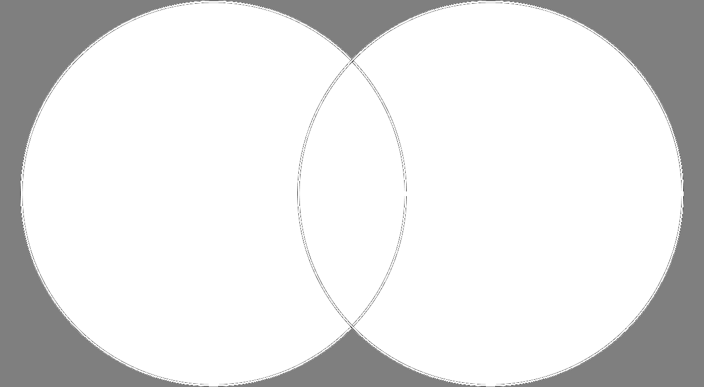
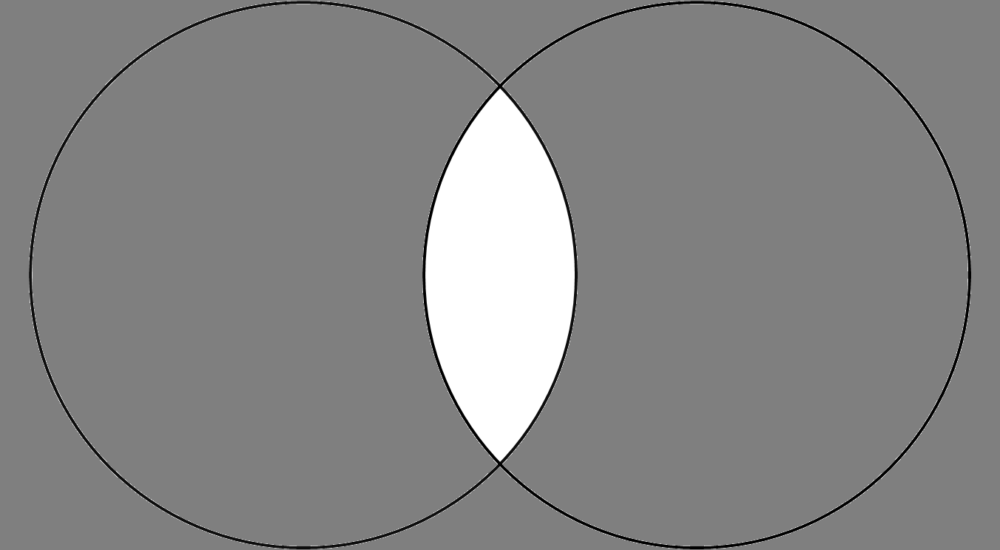
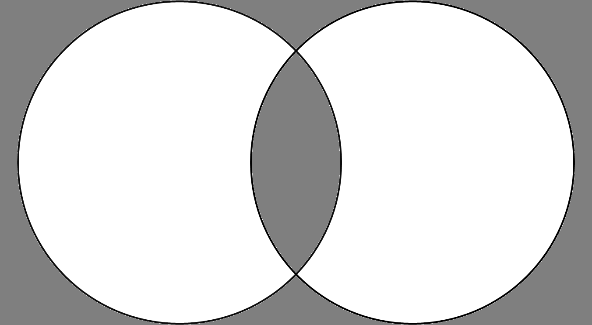
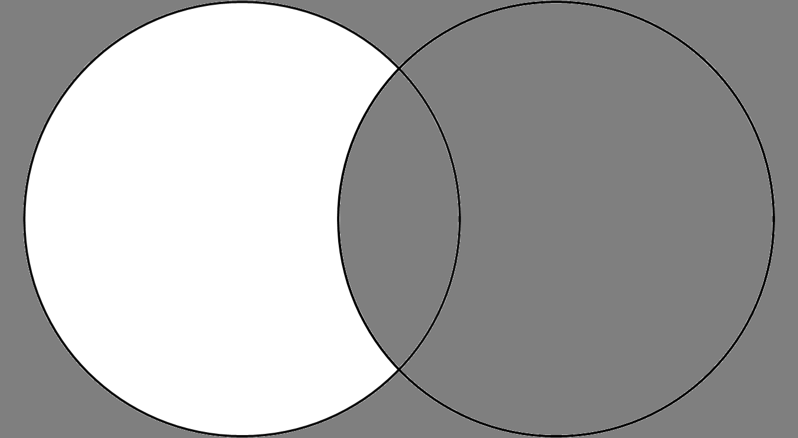

# Joining Sets
Sets in py more or less work in the same way as sets in mathematics. We can perform operations like union and intersection on the sets just like in mathematics.

## 1. union():
Combines all elements from both sets, removing duplicates.



### Example:
```py
web_dev_languages = {'Python', 'JavaScript', 'C++', 'Java'}
mobile_dev_languages = {'Ruby', 'Python', 'Swift', 'JavaScript'}

all_languages = web_dev_languages.union(mobile_dev_languages)
print('Union:', all_languages)
```
### Output:
```
Union: {'Java', 'Python', 'JavaScript', 'Ruby', 'Swift', 'C++'}
```
## 2. intersection():
Finds elements that are common in both sets.



### Example:
```py
web_dev_languages = {'Python', 'JavaScript', 'C++', 'Java'}
mobile_dev_languages = {'Ruby', 'Python', 'Swift', 'JavaScript'}

common_languages = web_dev_languages.intersection(mobile_dev_languages)
print('Intersection:', common_languages)
```
### Output:
```
Intersection: {'Python', 'JavaScript'}
```

## 3. symmetric_difference():
Finds elements that are in either of the sets but not in both.



### Example:
```py
web_dev_languages = {'Python', 'JavaScript', 'C++', 'Java'}
mobile_dev_languages = {'Ruby', 'Python', 'Swift', 'JavaScript'}

unique_languages = web_dev_languages.symmetric_difference(mobile_dev_languages)
print('Symmetric Difference:', unique_languages)
```
### Output:
```
Symmetric Difference: {'Ruby', 'Swift', 'C++', 'Java'}
```

## 4. difference():
Finds elements that are in the first set but not in the second.



#### Example:
```py
web_dev_languages = {'Python', 'JavaScript', 'C++', 'Java'}
mobile_dev_languages = {'Ruby', 'Python', 'Swift', 'JavaScript'}

web_only_languages = web_dev_languages.difference(mobile_dev_languages)
mobile_only_languages = mobile_dev_languages.difference(web_dev_languages)
print('Difference-1:', web_only_languages)
print('Difference-2:', mobile_only_languages)
```
#### Output:
```
Difference-1: {'C++', 'Java'}
Difference-2: {'Ruby', 'Swift'}
```